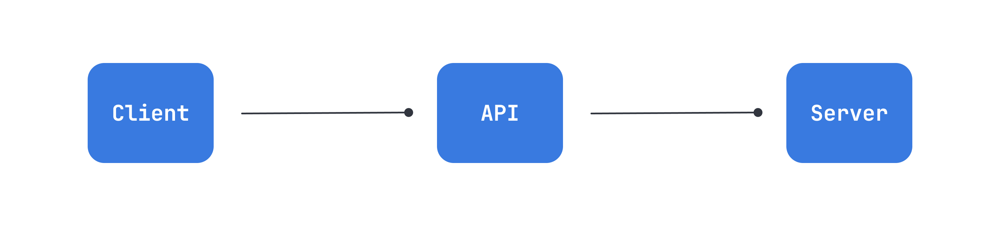
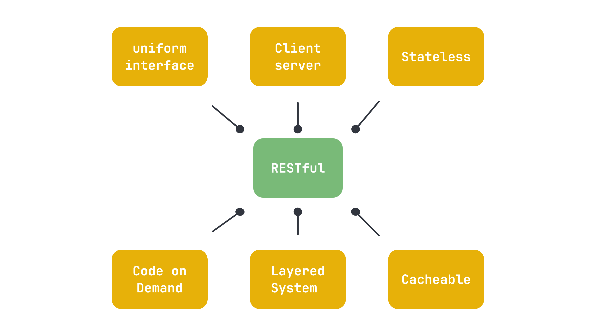

# Api

Acrônimo de Application Programming Interface (Interface de Programação de Aplicações) é basicamente um conjunto de rotinas e padrões estabelecidos por uma aplicação, para que outras aplicações possam utilizar as funcionalidades desta aplicação.

# Rest

um acrônimo para REpresentational State Transfer (Transferência de Estado Representativo).

Será feita a transferência de dados de uma maneira simbólica, figurativa, representativa, de maneira didática.

A transferência de dados, geralmente, usando o [protocolo HTTP](https://developer.mozilla.org/pt-BR/docs/Web/HTTP).

O REST delimita algumas obrigações nessas transferências de dados.

Resources seria então: Uma entidade ou um objeto.

# Restful

RESTful, é a aplicação dos padrões REST.

> **Uniform Interface:** Manter uma uniformidade, uma constância, um padrão na construção da interface. Nossa API precisa ser coerente para quem vai consumi-lá. Precisa fazer sentido para o cliente e não ser confusa. Logo, coisas como: o uso correto dos verbos HTTP; endpoints coerentes (todos os endpoints no plural, por exemplo); usar somente uma linguagem de comunicação (json) e não várias ao mesmo tempo; sempre enviar respostas aos clientes; são exemplos de aplicação de uma interface uniforme.

> **Client-server:** Separação do cliente e do armazenamento de dados (servidor), dessa forma, poderemos ter uma portabilidade do nosso sistema, usando o React para WEB e React Native para o smartphone, por exemplo.

> **Stateless:** Cada requisição que o cliente faz para o servidor, deverá conter todas as informações necessárias para o servidor entender e responder (RESPONSE) a requisição (REQUEST). Exemplo: A sessão do usuário deverá ser enviada em todas as requisições, para saber se aquele usuário está autenticado e apto a usar os serviços, e o servidor não pode lembrar que o cliente foi autenticado na requisição anterior. Nos nossos cursos, temos por padrão usar tokens para as comunicações.

> **Cacheable:** As respostas para uma requisição, deverão ser explicitas ao dizer se aquela resquição, pode ou não ser cacheada pelo cliente.

> **Layered System:** O cliente acessa a um endpoint, sem precisar saber da complexidade, de quais passos estão sendo necessários para o servidor responder a requisição, ou quais outras camadas o servidor estará lidando, para que a requisição seja respondida.

> **Code on demand (optional):** Dá a possibilidade da nossa aplicação pegar códigos, como o javascript, por exemplo, e executar no cliente.

-----

# Verbos http

- [GET](https://developer.mozilla.org/pt-BR/docs/Web/HTTP/Methods/GET): Receber dados de um Resource. 
- [POST](https://developer.mozilla.org/pt-BR/docs/Web/HTTP/Methods/POST): Enviar dados ou informações para serem processados por um Resource.
- [PUT](https://developer.mozilla.org/pt-BR/docs/Web/HTTP/Methods/PUT): Atualizar dados de um Resource.
- [DELETE](https://developer.mozilla.org/pt-BR/docs/Web/HTTP/Methods/DELETE): Deletar um Resource

# Boas práticas

- Utilizar verbos HTTP para nossas requisições.
-  Utilizar plural ou singular na criação dos endpoints? NÃO IMPORTA! use um padrão!!
-  Não deixar barra no final do endpoint
-  Nunca deixe o cliente sem resposta!

-----

# Api

An acronym for Application Programming Interface, is basically a set of routines and standards established by an application so that other applications can use the functionalities of this application.

# Rest

An acronym for REpresentational State Transfer.

It will be the transfer of data in a symbolic, figurative, representative, didactic manner.

Data transfer is usually done using the [HTTP protocol](https://developer.mozilla.org/en-US/docs/Web/HTTP).

REST imposes some obligations on these data transfers.

Resources would then be: An entity or an object.

# Restful

RESTful is the application of REST standards.

> **Uniform Interface:** Maintain uniformity, consistency, and standardization in the construction of the interface. Our API needs to be coherent for those who will consume it. It should make sense to the client and not be confusing. Therefore, aspects like the correct use of HTTP verbs, coherent endpoints (all endpoints in plural, for example), using only one communication language (JSON) and not multiple at the same time, always sending responses to clients, are examples of applying a uniform interface.

> **Client-server:** Separation of the client and data storage (server), thus enabling the portability of our system, using React for web and React Native for smartphones, for example.

> **Stateless:** Each request made by the client to the server must contain all the necessary information for the server to understand and respond (RESPONSE) to the request (REQUEST). Example: The user session must be sent with every request to verify if the user is authenticated and authorized to use the services, and the server cannot remember that the client was authenticated in the previous request. In our courses, we typically use tokens for communications.

> **Cacheable:** The responses to a request must explicitly state whether the request can be cached by the client.

> **Layered System:** The client accesses an endpoint without needing to understand the complexity or the steps required for the server to respond to the request, or which other layers the server is dealing with to respond to the request.

> **Code on Demand (optional):** Gives our application the ability to fetch and execute code, such as JavaScript, on the client side.

-----

# HTTP Verbs

- [GET](https://developer.mozilla.org/en-US/docs/Mozilla/Add-ons/WebExtensions/API/types/BrowserSetting/get): Retrieve data from a Resource.
- [POST](https://developer.mozilla.org/en-US/docs/Web/HTTP/Methods/POST): Send data or information to be processed by a Resource.
- [PUT](https://developer.mozilla.org/en-US/docs/Web/HTTP/Methods/PUT): Update data of a Resource.
- [DELETE](https://developer.mozilla.org/en-US/docs/Web/HTTP/Methods/DELETE): Delete a Resource.

# Best Practices

-   Use HTTP verbs for our requests.
-   Use plural or singular in the creation of endpoints? IT DOESN'T MATTER! use a standard!!
-   Do not leave a trailing slash at the end of the endpoint.
-   Never leave the client without a response!

-----